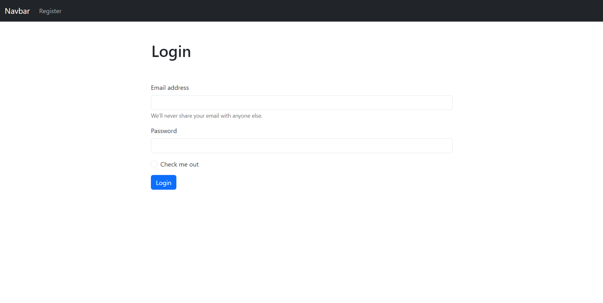
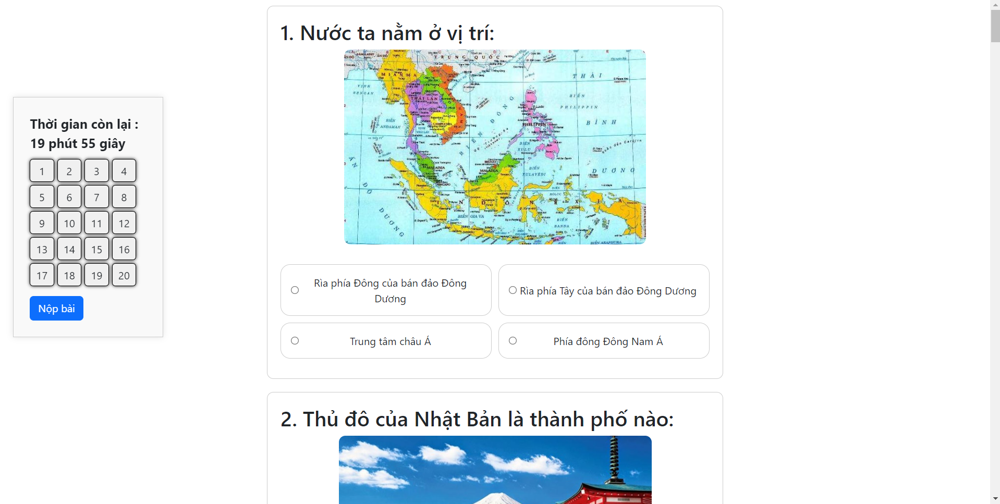

# Ứng dụng tạo câu hỏi trắc nghiệm (Quizlet-liked)

- Mô tả vắn tắt tên ứng dụng ở đây (Gợi ý: ứng dụng giải quyết vấn đề gì, có các đối tượng người dùng như thế nào, có các chức năng gì...)

- Bạn có thể trải nghiệm ứng dụng ở đây [LINK](https://one7-quizlet-liked.onrender.com/)
- Một số sceenshot của ứng dụng

## CÀI ĐẶT

Hướng dẫn cài đặt và chạy sau khi pull project từ github về (Lưu ý: hướng dẫn phải chạy được). Bao gồm:
- Các phần mềm cần cài đặt
- Các gói thư viện python cần dùng (có thể sử dụng pip freeze để tạo)
- Script tạo database (Để script trong thư mục installation)
- Script tạo dữ liệu (Để script trong thư mục installation)
# Hướng dẫn cài đặt và chạy bằng docker
- 1. Cài Đặt Docker: Đảm bảo rằng tất cả người dùng đã cài đặt Docker trên máy tính của họ. Bạn có thể hướng dẫn họ cài đặt Docker từ trang chính thức docker.com.
- 2. Pull Project từ GitHub: Đầu tiên, hãy sử dụng Git để pull project từ GitHub về máy tính của bạn. Bạn có thể sử dụng lệnh sau trong terminal hoặc command prompt:
      - git clone https://github.com/tyhuynh03/17_Quizlet-liked/
- 3. Chạy Docker Compose:
     - Điều hướng đến thư mục gốc của project đã clone.
     - Chạy lệnh sau để tạo và chạy Docker containers từ file docker-compose.yml:
     - docker-compose up --build
- Sau khi các containers được khởi động, ứng dụng web sẽ được chạy trên địa chỉ http://localhost:8000/.

# Hướng dẫn cài đặt và chạy bằng xampp
- Ngoài cách chạy bằng docker chúng ta có thể dùng xampp
- 1. Cài đặt xampp: https://www.apachefriends.org/download.html
- 2. Pull Project từ GitHub: Đầu tiên, hãy sử dụng Git để pull project từ GitHub về máy tính của bạn. Bạn có thể sử dụng lệnh sau trong terminal hoặc command prompt:
    git clone https://github.com/tyhuynh03/17_Quizlet-liked/
- 3. Mở xampp, Chọn start Apache và MySql -> Chọn Admin của MySql, chọn 'mới' -> Tạo hệ csdl tên 'django'.
- 4. Copy thư mục scrips vào src
- 5. Chạy các câu lệnh trên terminal theo thứ tự:
    pip install -r requirements.txt để cài các thư viện cần dùng
     python manage.py makemigrations ->python manage.py migrate->
     python manage.py runscript import_data->
     python manage.py runscript populate_data_from_csv ->  
     -> python manage.py runserver
- Sau khi hoàn tất các bước, web sẽ được chạy trên địa chỉ http://127.0.0.1:8000/.

## THÔNG TIN THÀNH VIÊN

- Huỳnh Tấn Tỷ - 21093521
- Hoàng Thanh Tú - 21105251
- Nguyễn Khắc Luật - 21099741
- Phạm Nhựt Minh - 21021471

## TRÁCH NHIỆM

- Thành viên 1:
    - trách nhiệm 1
    - trách nhiệm 2
- Thành viên 2
    - trách nhiệm 1
    - trách nhiệm 2
- ...

---
