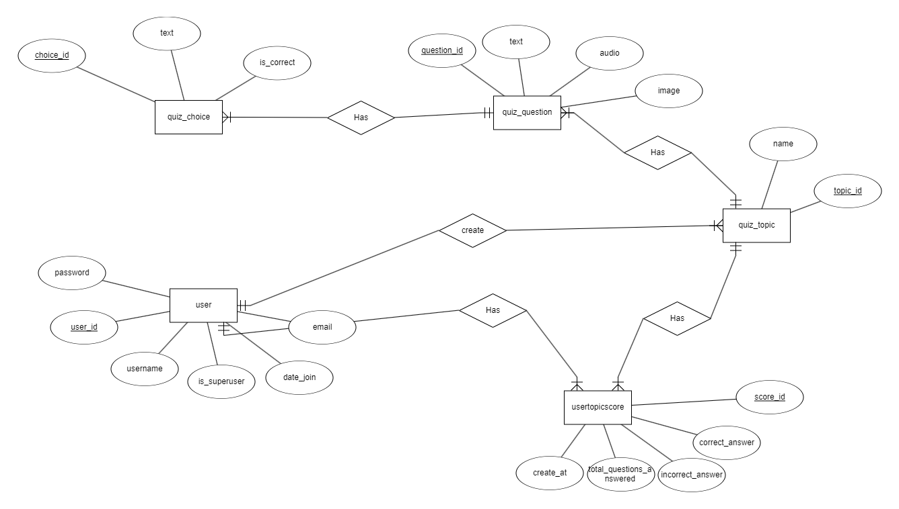

## 3. THIẾT KẾ

### 3.1. Activity Diagram
Sơ đồ hoạt động

### 3.2. ER Diagram
Sơ đồ ER

### 3.3. Database Diagram

Sơ đồ trên Hệ quản trị CSDL

### 3.4. Screen flow

Sơ đồ phân luồng màn hình ứng dụng

