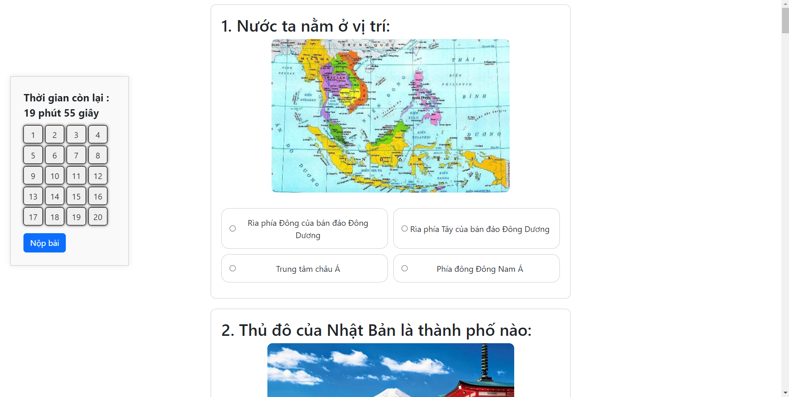

## 4. HIỆN THỰC

### 4.1. Công nghệ sử dụng
Trong dự án này, chúng tôi đã sử dụng một loạt các công nghệ tiên tiến để phát triển và triển khai ứng dụng. Các công nghệ được lựa chọn nhằm đảm bảo tính ổn định, bảo mật, và hiệu suất cao. Dưới đây là chi tiết về các công nghệ sử dụng ở cả phía front-end, back-end và các phần mở rộng khác:
### 4.1.1. Công nghệ Front-end
  ### Django Templates:
     - Giới thiệu: Django Templates là hệ thống template được tích hợp sẵn trong Django, giúp tạo ra các trang web động một cách dễ dàng.
     - Tính năng: Hỗ trợ cú pháp template đơn giản, kế thừa template, và khả năng tích hợp các biến từ back-end để hiển thị dữ liệu động.
  ### Bootstrap:
     - Giới thiệu: Bootstrap là một framework front-end mã nguồn mở được sử dụng để thiết kế giao diện web đáp ứng và di động đầu tiên.
     - Tính năng: Cung cấp các thành phần giao diện người dùng (UI) như form, button, navigation, và các tiện ích JavaScript, giúp tạo ra giao diện web hiện đại và dễ dàng tương thích với   
    nhiều loại thiết bị.
### 4.1.2. Công nghệ Back-end
  ### Django:
     - Giới thiệu: Django là một framework web cấp cao, viết bằng Python, giúp phát triển các ứng dụng web nhanh chóng và dễ dàng.
     - Tính năng: Django cung cấp một hệ thống ORM mạnh mẽ, hệ thống template linh hoạt, và một bảng điều khiển quản trị tiện lợi. Nó cũng hỗ trợ quản lý người dùng, xác thực và các tính năng bảo mật khác.
  ### Django Rest Framework(djangorestframework):
     - Giới thiệu: Django Rest Framework (DRF) là một bộ công cụ mạnh mẽ và linh hoạt để xây dựng các API web.
     - Tính năng: DRF hỗ trợ serialization, kiểm soát quyền truy cập, và cung cấp nhiều công cụ để xây dựng các API RESTful một cách dễ dàng.
  ### Requests:
     - Giới thiệu: Requests là một thư viện HTTP đơn giản và gọn nhẹ cho Python, cho phép gửi yêu cầu HTTP dễ dàng.
     - Tính năng: Nó hỗ trợ các phương thức HTTP như GET, POST, PUT, DELETE, và xử lý các yêu cầu phức tạp như xác thực, phiên làm việc và mã hóa SSL.
### 4.1.3. Extensions và thư viện hỗ trợ
  ### django-extensions:
     - Giới thiệu: Django Extensions cung cấp một tập hợp các phần mở rộng hữu ích cho Django, giúp việc phát triển và quản lý dự án trở nên dễ dàng hơn.
     - Tính năng: Bao gồm nhiều tiện ích như shell_plus, model extensions, và các công cụ phát triển khác.
  ### Pillow:
     - Giới thiệu: Pillow là một thư viện xử lý hình ảnh mạnh mẽ và phổ biến trong Python.
     - Tính năng: Hỗ trợ nhiều định dạng hình ảnh và cung cấp các chức năng để chỉnh sửa, xử lý, và lưu trữ hình ảnh.
### 4.1.4. Công nghệ triển khai
  ### Docker:
     - Giới thiệu: Docker là một nền tảng phần mềm giúp triển khai các ứng dụng trong các container, giúp đảm bảo rằng ứng dụng chạy mượt mà trong mọi môi trường.
     - Tính năng: Docker tạo ra các container độc lập, nhẹ, chứa tất cả các phần mềm cần thiết để chạy ứng dụng, bao gồm mã nguồn, thư viện, và các phụ thuộc.
  ### Render.com:
     - Giới thiệu: Render.com là một nền tảng dịch vụ lưu trữ đám mây giúp triển khai ứng dụng web một cách dễ dàng và hiệu quả.
     - Tính năng: Render.com hỗ trợ triển khai các ứng dụng Docker, tự động hóa quá trình xây dựng và triển khai, quản lý cơ sở dữ liệu, và cung cấp các tính năng bảo mật như SSL và xác thực người dùng.
### 4.1.5. Công cụ kiểm thử
  ### Postman:
     - Giới thiệu: Postman là một công cụ phổ biến để phát triển và kiểm thử API.
     - Tính năng: Hỗ trợ tạo và gửi các yêu cầu HTTP, kiểm tra phản hồi, và tự động hóa các kịch bản kiểm thử API. Postman cung cấp giao diện người dùng trực quan và nhiều tính năng mạnh mẽ như tạo bộ sưu tập yêu cầu, lưu trữ và chia sẻ các kịch bản kiểm thử.
 ### 4.2. Giao diện ứng dụng 
Giao diện trang home

 

Giao diện trang đăng nhập

Giao diện trang làm bài quiz

### 4.3. Kết quả

### Làm được
- 1.	Chức năng đăng nhập cho người dùng:
    -  Đã triển khai hệ thống xác thực người dùng, cho phép người dùng đăng ký và đăng nhập vào hệ thống.
    -  Sử dụng Django's built-in authentication system để đảm bảo tính bảo mật và dễ dàng quản lý người dùng.
- 2.	Chức năng làm bài trắc nghiệm (Quiz):
    -  Người dùng có thể truy cập và làm các bài trắc nghiệm được tạo sẵn.
    -  Giao diện trực quan, dễ sử dụng giúp người dùng có trải nghiệm tốt khi làm bài trắc nghiệm.
- 3.	Trang kết quả sau khi trả lời bài trắc nghiệm:
    -  Hiển thị kết quả ngay sau khi người dùng hoàn thành bài trắc nghiệm.
    -  Cung cấp thông tin chi tiết về câu trả lời đúng và sai, giúp người dùng hiểu rõ hơn về kết quả của mình.
    -  Biểu đồ trực quan hiển thị số lượng câu trả lời đúng và sai, giúp người dùng dễ dàng nắm bắt được hiệu quả làm bài của mình.
- 4.	Chức năng quản lý câu hỏi của người dùng:
    -  Người dùng có quyền xem và xóa các câu hỏi riêng của mình.
    -  Hệ thống quản lý câu hỏi và chủ đề giúp người dùng dễ dàng theo dõi và quản lý nội dung của mình.
- 5.	Chức năng thêm câu hỏi bằng file CSV hoặc thủ công:
    -  Người dùng có thể thêm câu hỏi mới vào hệ thống bằng cách tải lên file CSV.
    -  Hệ thống hỗ trợ nhập liệu thủ công cho từng câu hỏi, cung cấp giao diện thân thiện để người dùng dễ dàng thêm và chỉnh sửa câu hỏi.
- 6.	Chức năng thêm hình ảnh cho câu hỏi:
    -  Người dùng có thể đính kèm hình ảnh vào câu hỏi để minh họa thêm.
    -  Hệ thống hỗ trợ tải lên hình ảnh từ máy tính.
- 7.	Trang dành riêng cho admin:
    -  Đã xây dựng một trang quản trị dành riêng cho admin.
    -  Admin có thể quản lý người dùng, chủ đề (topics), và các câu hỏi.
    -  Giao diện quản trị thân thiện, dễ sử dụng, có dashboard trực quan giúp admin có cái nhìn tổng quan về hệ thống.
- 8.	Triển khai ứng dụng lên hosting:
    -  Đã triển khai thành công trang web quizlet lên hosting sử dụng Render.com.
  -  Sử dụng Docker để container hóa ứng dụng và đảm bảo tính nhất quán trong môi trường triển khai.
    -  Đảm bảo rằng ứng dụng hoạt động ổn định và có thể truy cập từ internet.
### Chưa làm được
- 1.	Chuyển đổi cơ sở dữ liệu từ SQLite sang PostgreSQL:
    -  Dự án hiện tại vẫn đang sử dụng SQLite làm cơ sở dữ liệu chính. Kế hoạch chuyển đổi sang PostgreSQL chưa hoàn thành.
    -  Cần thiết lập và cấu hình PostgreSQL, sau đó di chuyển dữ liệu từ SQLite sang PostgreSQL.
### Hướng phát triển
- 1.	Hoàn thiện việc chuyển đổi cơ sở dữ liệu sang PostgreSQL:
    -  Cài đặt PostgreSQL và cấu hình trong dự án Django.
    -  Sử dụng các công cụ di chuyển dữ liệu để chuyển dữ liệu từ SQLite sang PostgreSQL.
    -  Kiểm tra và đảm bảo rằng tất cả các chức năng hoạt động tốt với cơ sở dữ liệu mới.
- 2.	Thêm chức năng nâng cao cho bài trắc nghiệm:
    -  Tích hợp thêm các loại câu hỏi khác nhau (ví dụ: câu hỏi dạng kéo thả, câu hỏi dạng lựa chọn hình ảnh).
    -  Cải thiện tính năng phân tích kết quả bài trắc nghiệm để cung cấp thông tin chi tiết hơn cho người dùng.
- 3.	Tích hợp thêm các tính năng xã hội:
    -  Cho phép người dùng chia sẻ kết quả bài trắc nghiệm lên mạng xã hội.
    -  Tạo tính năng thảo luận, nơi người dùng có thể thảo luận về các câu hỏi và chủ đề.
- 4.	Phát triển ứng dụng di động:
    -  Tạo ứng dụng di động để người dùng có thể truy cập và làm bài trắc nghiệm trên thiết bị di động của mình.
    -  Sử dụng các framework phát triển ứng dụng di động như React Native hoặc Flutter để xây dựng ứng dụng cho cả Android và iOS.
    -  Đồng bộ hóa dữ liệu giữa ứng dụng di động và hệ thống backend hiện có.

