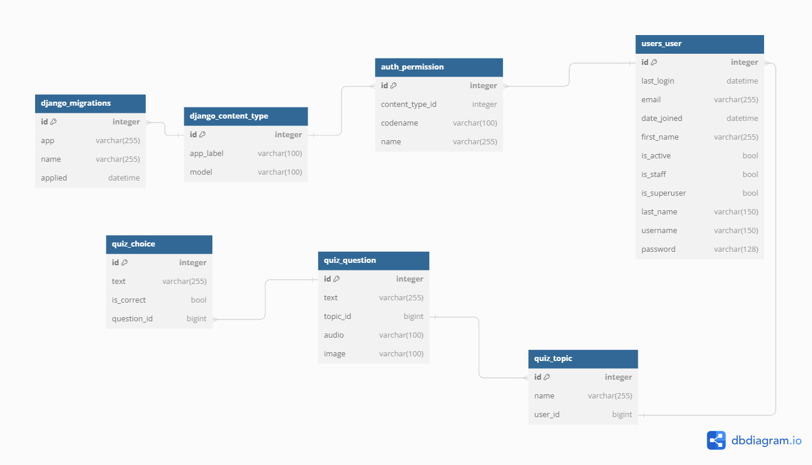
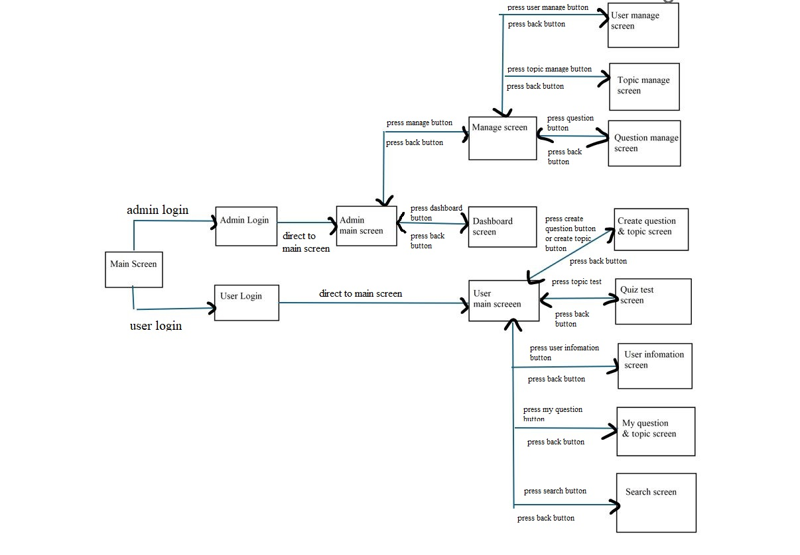
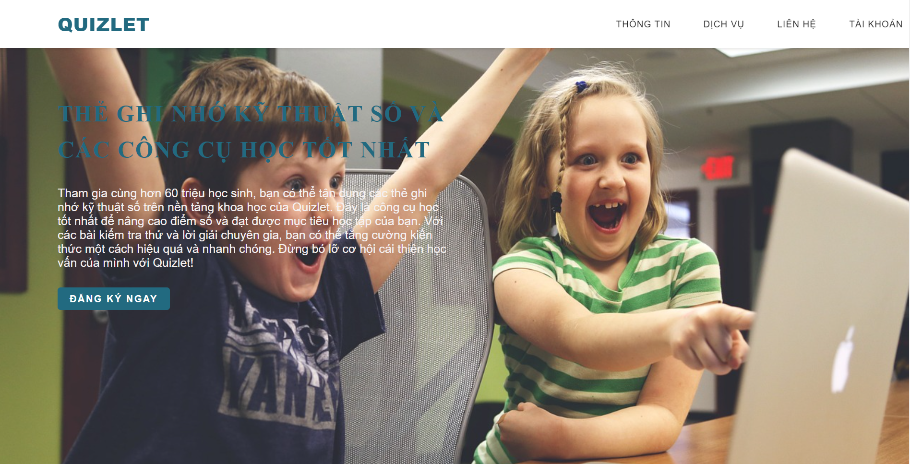
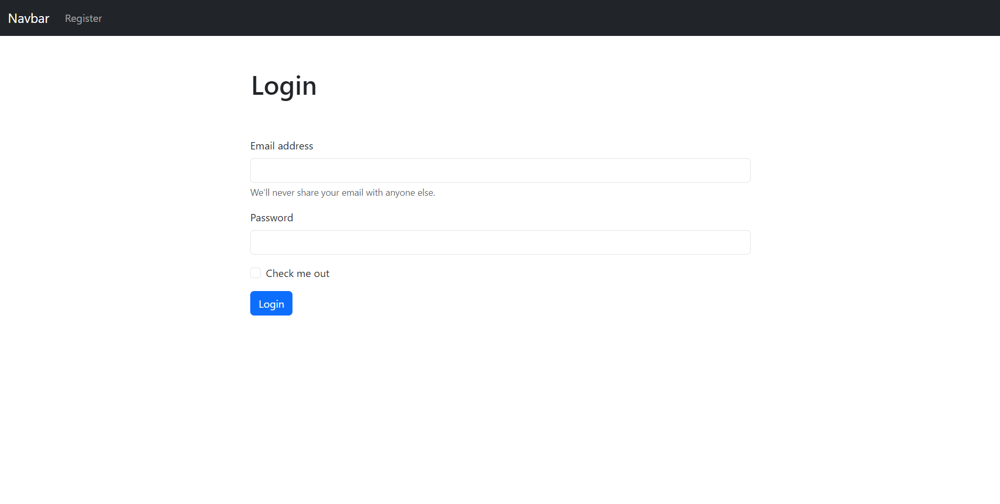
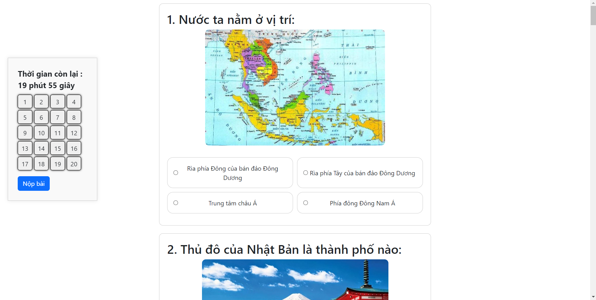

## 1. KẾ HOẠCH
### 1.1 Mô tả ý tưởng đề tài
  Đề tài của ứng dụng Quizlet là xây dựng một nền tảng trực tuyến hỗ trợ học tập thông qua các bài trắc nghiệm (quiz). Ý tưởng chính là tạo ra một công cụ tiện lợi và dễ sử dụng cho việc ôn tập, kiểm tra kiến thức và tự học. Quizlet hướng đến việc cung cấp một phương pháp học tập hiện đại, kết hợp giữa nội dung học thuật và các tính năng tương tác, nhằm tăng cường hiệu quả học tập và đánh giá năng lực của người dùng.
### 1.2 Sản phẩm MVP
Sản phẩm MVP được thiết kế để một cá nhân có thể sử dụng và trải nghiệm các chức năng quan trọng của ứng dụng, bao gồm:
- Tạo Câu Hỏi:
  - Thêm câu hỏi mới: Người dùng có thể tạo các câu hỏi mới để thêm vào bộ câu hỏi.
  - Đính kèm hình ảnh: Cho phép người dùng đính kèm hình ảnh vào câu hỏi để minh họa.
- Làm Bài Trắc Nghiệm:
  - Tham gia bài trắc nghiệm: Người dùng có thể làm các bài trắc nghiệm dựa trên bộ câu hỏi đã tạo hoặc có sẵn.
  - Hiển thị kết quả: Hiển thị kết quả chi tiết ngay sau khi hoàn thành bài trắc nghiệm, bao gồm biểu đồ trực quan về câu trả lời đúng và sai.
### 1.3 Sản phẩm hoàn thiện
Sản phẩm hoàn thiện của Quizlet sẽ bao gồm tất cả các chức năng của MVP và mở rộng thêm các tính năng nâng cao để mang lại trải nghiệm học tập toàn diện hơn:
  - Đăng Nhập và Đăng Ký Tài Khoản:
    - Hệ thống xác thực cho phép người dùng tạo tài khoản mới và đăng nhập vào hệ thống.
    - Quản lý hồ sơ cá nhân và bảo mật thông tin người dùng.
  - Tạo Câu Hỏi:
    - Thêm các loại câu hỏi đa dạng như trắc nghiệm, tự luận, kéo thả, và lựa chọn hình ảnh.
    - Đính kèm hình ảnh và tài liệu minh họa vào câu hỏi để làm phong phú nội dung học tập.
  - Quản Lý Bộ Câu Hỏi:
    - Tạo, chỉnh sửa, và xóa các câu hỏi và chủ đề.
    - Tổ chức các câu hỏi theo các bộ câu hỏi khác nhau để dễ dàng quản lý và sử dụng.
  - Tìm Kiếm và Khám Phá:
    - Tính năng tìm kiếm giúp người dùng dễ dàng tìm thấy các bài trắc nghiệm hoặc câu hỏi phù hợp.
    - Khám phá các bộ câu hỏi và bài trắc nghiệm do người dùng khác tạo ra.
  - Làm Bài Trắc Nghiệm:
    - Người dùng có thể tham gia các bài trắc nghiệm dựa trên bộ câu hỏi đã tạo hoặc khám phá được.
    - Hiển thị kết quả chi tiết sau khi hoàn thành bài trắc nghiệm, bao gồm biểu đồ trực quan về câu trả lời đúng và sai.
  - Bộ Câu Hỏi Mẫu:
    - Cung cấp sẵn 5 bộ câu hỏi mẫu để người dùng mới có thể tham khảo và bắt đầu ngay lập tức.
    - Các bộ câu hỏi mẫu này sẽ giúp người dùng làm quen với hệ thống và cách tạo, quản lý câu hỏi.
  - Chia Sẻ Bộ Câu Hỏi
    - Tạo và Chia Sẻ Bộ Câu Hỏi: Người dùng có thể tạo các bộ câu hỏi và sau đó chia sẻ chúng với cộng đồng hoặc các nhóm học tập cụ thể.
    - Sử Dụng Bộ Câu Hỏi Chia Sẻ: Người dùng khác có thể tìm kiếm, truy cập và sử dụng các bộ câu hỏi được chia sẻ để làm bài trắc nghiệm hoặc ôn tập.

## 2. PHÂN TÍCH
### 2.1 Giới thiệu
#### 2.1.1. Mục đích
Mục đích của tài liệu này nhằm mô tả một cách đầy đủ và toàn diện yêu cầu của ứng dụng: các yêu cầu chức năng, yêu cầu phi chức năng, các ràng buộc về mặt thiết kế.
* Yêu Cầu Chức Năng (Functional Requirements):
  - Quản lý Người Dùng:
    + Chức năng đăng nhập và đăng ký.
    + Khả năng tạo, chỉnh sửa và xóa người dùng (chỉ dành cho admin).
    + Quản lý vai trò của người dùng (admin hoặc user).
  - Quản Lý Chủ Đề:
    + Tạo, chỉnh sửa và xóa chủ đề câu hỏi.
    + Liệt kê danh sách chủ đề câu hỏi.
  - Quản Lý Câu Hỏi:
    + Tạo, chỉnh sửa và xóa câu hỏi trong từng chủ đề.
    + Hiển thị danh sách câu hỏi trong mỗi chủ đề.
  - Trả Lời Câu Hỏi:
    + Người dùng có thể trả lời các câu hỏi có sẵn trong hệ thống.
    + Tính điểm và hiển thị kết quả sau khi trả lời câu hỏi.
* Yêu Cầu Phi Chức Năng (Non-functional Requirements):
  - Giao Diện Người Dùng:
    + Giao diện thân thiện, dễ sử dụng.
    + Tốc độ tải trang nhanh chóng.
  - Bảo Mật:
    + Hệ thống phải đảm bảo an toàn thông tin người dùng và dữ liệu câu hỏi.
* Ràng Buộc Thiết Kế (Design Constraints):
  - Công Nghệ:
    + Sử dụng Django framework cho backend và HTML, CSS, JavaScript cho frontend.
    + Sử dụng cơ sở dữ liệu quan hệ MySQL

#### 2.1.2 Phạm vi
Mô tả ngắn gọn đặc điểm của ứng dụng; phạm vi, đối tượng phục vụ của ứng dụng; nhóm các hệ thống con
Chỉ ra được tài liệu này dùng cho đối tượng nào?
- Phạm vi: Ứng dụng hướng đến người dùng muốn tự kiểm tra kiến thức hoặc tạo bài kiểm tra để chia sẻ với người khác.
- Đối Tượng Phục Vụ:
  + Sinh viên, học sinh muốn ôn tập kiến thức.
  + Giáo viên muốn tạo bài kiểm tra cho học sinh.
  + Các chuyên gia muốn chia sẻ kiến thức chuyên môn.
### 2.2 Phân tích yêu cầu
#### 2.2.1 Đặc tả Actors
- Actor 1: Admin
  * Mô tả: Người quản trị hệ thống, có quyền truy cập vào tất cả các chức năng và tính năng của trang web.
- Actor 2: User
  * Mô tả: Người dùng cuối, tham gia vào việc tạo, trả lời câu hỏi và sử dụng các tính năng khác của trang web.
#### 2.2.2 Đặc tả Use-cases
- Danh sách các use-cases:
    - UC01: đăng ký/đăng nhập
        + Nếu chưa có tài khoản thì sẽ vào giao diện đăng ký. Đăng ký thì cần gmail, tên đăng nhập và mật khẩu
        + Sau khi đăng nhập thì tùy vào loại tài khoản mà vào 2 giao diện khác nhau: giao diện cho admin và giao diện cho user
    - UC02: quản lý chủ đề, câu hỏi
        + Quản lý chủ đề: tạo, chỉnh sửa, xóa chủ đề câu hỏi.
        + Quản lý câu hỏi: tạo, chỉnh sửa, xóa câu hỏi.
        + Xem danh sách chủ đề, câu hỏi đã có
    - UC03: tìm kiếm
        + Tìm kiếm câu hỏi, chủ đề có sẵn
    - UC04: làm kiểm tra
        + Làm kiểm tra trên bộ câu hỏi đã chọn
        + Xem thống kê, tính điểm
    - UC05: Quản lý tài khoản 
        + Tạo, chỉnh sửa, xóa tài khoản
        + Xem, xóa, sửa thông tin cá nhân
    - UC06: Xem thống kê và báo cáo
        + Xem số chủ đề, câu hỏi đã tạo
        + Xem thời gian làm kiểm tra, tỷ lệ trả lời đúng
- Liệt kê các use-cases theo actor: (LƯU Ý: nếu phần này các chức năng thực hiện khác nhau ở mỗi actor thì ghi rõ các khác nhau đó)
    - Actor 1: Admin
        - UC01: đăng ký, đăng nhập
        - UC02: quản lý chủ đề, câu hỏi
            + tạo và chỉnh sửa, xóa chủ đề, câu hỏi của TẤT CẢ người dùng
        - UC03: tìm kiếm
        - UC04: làm kiểm tra
        - UC05: Quản lý tài khoản 
            + Tạo, chỉnh sửa, xóa tài khoản của TẤT CẢ người dùng
            + Xem, xóa, sửa thông tin cá nhân
        - UC06: Xem thống kê và báo cáo
            + Xem số chủ đề, câu hỏi đã tạo của TẤT CẢ người dùng
            + Xem thời gian làm kiểm tra, tỷ lệ trả lời đúng của TẤT CẢ người dùng
    - Actor 2: User
        - UC01: đăng ký, đăng nhập
        - UC02: quản lý chủ đề, câu hỏi
            + tạo và chỉnh sửa, xóa chủ đề, câu hỏi của CÁ NHÂN
            + chỉ có quyền xem chủ đề và câu hỏi của người khác
        - UC03: tìm kiếm
        - UC04: làm kiểm tra
        - UC05: Quản lý tài khoản 
            + Tạo, chỉnh sửa, xóa tài khoản của CÁ NHÂN
            + Xem, xóa, sửa thông tin cá nhân
        - UC06: Xem thống kê và báo cáo
            + Xem số chủ đề, câu hỏi đã tạo của CÁ NHÂN
            + Xem thời gian làm kiểm tra, tỷ lệ trả lời đúng của CÁ NHÂN

## 3. THIẾT KẾ

### 3.1. Activity Diagram
Sơ đồ hoạt động

### 3.2. ER Diagram
Sơ đồ ER

### 3.3. Database Diagram

Sơ đồ trên Hệ quản trị CSDL

### 3.4. Screen flow

Sơ đồ phân luồng màn hình ứng dụng

## 4. HIỆN THỰC

### 4.1. Công nghệ sử dụng
Trong dự án này, chúng tôi đã sử dụng một loạt các công nghệ tiên tiến để phát triển và triển khai ứng dụng. Các công nghệ được lựa chọn nhằm đảm bảo tính ổn định, bảo mật, và hiệu suất cao. Dưới đây là chi tiết về các công nghệ sử dụng ở cả phía front-end, back-end và các phần mở rộng khác:
### 4.1.1. Công nghệ Front-end
  ### Django Templates:
     - Giới thiệu: Django Templates là hệ thống template được tích hợp sẵn trong Django, giúp tạo ra các trang web động một cách dễ dàng.
     - Tính năng: Hỗ trợ cú pháp template đơn giản, kế thừa template, và khả năng tích hợp các biến từ back-end để hiển thị dữ liệu động.
  ### Bootstrap:
     - Giới thiệu: Bootstrap là một framework front-end mã nguồn mở được sử dụng để thiết kế giao diện web đáp ứng và di động đầu tiên.
     - Tính năng: Cung cấp các thành phần giao diện người dùng (UI) như form, button, navigation, và các tiện ích JavaScript, giúp tạo ra giao diện web hiện đại và dễ dàng tương thích với   
    nhiều loại thiết bị.
### 4.1.2. Công nghệ Back-end
  ### Django:
     - Giới thiệu: Django là một framework web cấp cao, viết bằng Python, giúp phát triển các ứng dụng web nhanh chóng và dễ dàng.
     - Tính năng: Django cung cấp một hệ thống ORM mạnh mẽ, hệ thống template linh hoạt, và một bảng điều khiển quản trị tiện lợi. Nó cũng hỗ trợ quản lý người dùng, xác thực và các tính năng bảo mật khác.
  ### Django Rest Framework(djangorestframework):
     - Giới thiệu: Django Rest Framework (DRF) là một bộ công cụ mạnh mẽ và linh hoạt để xây dựng các API web.
     - Tính năng: DRF hỗ trợ serialization, kiểm soát quyền truy cập, và cung cấp nhiều công cụ để xây dựng các API RESTful một cách dễ dàng.
  ### Requests:
     - Giới thiệu: Requests là một thư viện HTTP đơn giản và gọn nhẹ cho Python, cho phép gửi yêu cầu HTTP dễ dàng.
     - Tính năng: Nó hỗ trợ các phương thức HTTP như GET, POST, PUT, DELETE, và xử lý các yêu cầu phức tạp như xác thực, phiên làm việc và mã hóa SSL.
### 4.1.3. Extensions và thư viện hỗ trợ
  ### django-extensions:
     - Giới thiệu: Django Extensions cung cấp một tập hợp các phần mở rộng hữu ích cho Django, giúp việc phát triển và quản lý dự án trở nên dễ dàng hơn.
     - Tính năng: Bao gồm nhiều tiện ích như shell_plus, model extensions, và các công cụ phát triển khác.
  ### Pillow:
     - Giới thiệu: Pillow là một thư viện xử lý hình ảnh mạnh mẽ và phổ biến trong Python.
     - Tính năng: Hỗ trợ nhiều định dạng hình ảnh và cung cấp các chức năng để chỉnh sửa, xử lý, và lưu trữ hình ảnh.
### 4.1.4. Công nghệ triển khai
  ### Docker:
     - Giới thiệu: Docker là một nền tảng phần mềm giúp triển khai các ứng dụng trong các container, giúp đảm bảo rằng ứng dụng chạy mượt mà trong mọi môi trường.
     - Tính năng: Docker tạo ra các container độc lập, nhẹ, chứa tất cả các phần mềm cần thiết để chạy ứng dụng, bao gồm mã nguồn, thư viện, và các phụ thuộc.
  ### Render.com:
     - Giới thiệu: Render.com là một nền tảng dịch vụ lưu trữ đám mây giúp triển khai ứng dụng web một cách dễ dàng và hiệu quả.
     - Tính năng: Render.com hỗ trợ triển khai các ứng dụng Docker, tự động hóa quá trình xây dựng và triển khai, quản lý cơ sở dữ liệu, và cung cấp các tính năng bảo mật như SSL và xác thực người dùng.
### 4.1.5. Công cụ kiểm thử
  ### Postman:
     - Giới thiệu: Postman là một công cụ phổ biến để phát triển và kiểm thử API.
     - Tính năng: Hỗ trợ tạo và gửi các yêu cầu HTTP, kiểm tra phản hồi, và tự động hóa các kịch bản kiểm thử API. Postman cung cấp giao diện người dùng trực quan và nhiều tính năng mạnh mẽ như tạo bộ sưu tập yêu cầu, lưu trữ và chia sẻ các kịch bản kiểm thử.
 ### 4.2. Giao diện ứng dụng 
Giao diện trang home

 

Giao diện trang đăng nhập

Giao diện trang làm bài quiz

### 4.3. Kết quả

# Làm được
- 1.	Chức năng đăng nhập cho người dùng:
    -  Đã triển khai hệ thống xác thực người dùng, cho phép người dùng đăng ký và đăng nhập vào hệ thống.
    -  Sử dụng Django's built-in authentication system để đảm bảo tính bảo mật và dễ dàng quản lý người dùng.
- 2.	Chức năng làm bài trắc nghiệm (Quiz):
    -  Người dùng có thể truy cập và làm các bài trắc nghiệm được tạo sẵn.
    -  Giao diện trực quan, dễ sử dụng giúp người dùng có trải nghiệm tốt khi làm bài trắc nghiệm.
- 3.	Trang kết quả sau khi trả lời bài trắc nghiệm:
    -  Hiển thị kết quả ngay sau khi người dùng hoàn thành bài trắc nghiệm.
    -  Cung cấp thông tin chi tiết về câu trả lời đúng và sai, giúp người dùng hiểu rõ hơn về kết quả của mình.
    -  Biểu đồ trực quan hiển thị số lượng câu trả lời đúng và sai, giúp người dùng dễ dàng nắm bắt được hiệu quả làm bài của mình.
- 4.	Chức năng quản lý câu hỏi của người dùng:
    -  Người dùng có quyền xem và xóa các câu hỏi riêng của mình.
    -  Hệ thống quản lý câu hỏi và chủ đề giúp người dùng dễ dàng theo dõi và quản lý nội dung của mình.
- 5.	Chức năng thêm câu hỏi bằng file CSV hoặc thủ công:
    -  Người dùng có thể thêm câu hỏi mới vào hệ thống bằng cách tải lên file CSV.
    -  Hệ thống hỗ trợ nhập liệu thủ công cho từng câu hỏi, cung cấp giao diện thân thiện để người dùng dễ dàng thêm và chỉnh sửa câu hỏi.
- 6.	Chức năng thêm hình ảnh cho câu hỏi:
    -  Người dùng có thể đính kèm hình ảnh vào câu hỏi để minh họa thêm.
    -  Hệ thống hỗ trợ tải lên hình ảnh từ máy tính.
- 7.	Trang dành riêng cho admin:
    -  Đã xây dựng một trang quản trị dành riêng cho admin.
    -  Admin có thể quản lý người dùng, chủ đề (topics), và các câu hỏi.
    -  Giao diện quản trị thân thiện, dễ sử dụng, có dashboard trực quan giúp admin có cái nhìn tổng quan về hệ thống.
- 8.	Triển khai ứng dụng lên hosting:
    -  Đã triển khai thành công trang web quizlet lên hosting sử dụng Render.com.
  -  Sử dụng Docker để container hóa ứng dụng và đảm bảo tính nhất quán trong môi trường triển khai.
    -  Đảm bảo rằng ứng dụng hoạt động ổn định và có thể truy cập từ internet.
# Chưa làm được
- 1.	Chuyển đổi cơ sở dữ liệu từ SQLite sang PostgreSQL:
    -  Dự án hiện tại vẫn đang sử dụng SQLite làm cơ sở dữ liệu chính. Kế hoạch chuyển đổi sang PostgreSQL chưa hoàn thành.
    -  Cần thiết lập và cấu hình PostgreSQL, sau đó di chuyển dữ liệu từ SQLite sang PostgreSQL.
# Hướng phát triển
- 1.	Hoàn thiện việc chuyển đổi cơ sở dữ liệu sang PostgreSQL:
    -  Cài đặt PostgreSQL và cấu hình trong dự án Django.
    -  Sử dụng các công cụ di chuyển dữ liệu để chuyển dữ liệu từ SQLite sang PostgreSQL.
    -  Kiểm tra và đảm bảo rằng tất cả các chức năng hoạt động tốt với cơ sở dữ liệu mới.
- 2.	Thêm chức năng nâng cao cho bài trắc nghiệm:
    -  Tích hợp thêm các loại câu hỏi khác nhau (ví dụ: câu hỏi dạng kéo thả, câu hỏi dạng lựa chọn hình ảnh).
    -  Cải thiện tính năng phân tích kết quả bài trắc nghiệm để cung cấp thông tin chi tiết hơn cho người dùng.
- 3.	Tích hợp thêm các tính năng xã hội:
    -  Cho phép người dùng chia sẻ kết quả bài trắc nghiệm lên mạng xã hội.
    -  Tạo tính năng thảo luận, nơi người dùng có thể thảo luận về các câu hỏi và chủ đề.
- 4.	Phát triển ứng dụng di động:
    -  Tạo ứng dụng di động để người dùng có thể truy cập và làm bài trắc nghiệm trên thiết bị di động của mình.
    -  Sử dụng các framework phát triển ứng dụng di động như React Native hoặc Flutter để xây dựng ứng dụng cho cả Android và iOS.
    -  Đồng bộ hóa dữ liệu giữa ứng dụng di động và hệ thống backend hiện có.

## 5. GHI CHÚ CÁC CÔNG VIỆC

### 5.1 Phân công

| STT | Họ và tên       | Công việc                                                  |
|-----|-----------------|------------------------------------------------------------|
| 1   | Huỳnh Tấn Tỷ    | - Xây dựng Backend - Thiết kế và xây dựng database - Tạo bộ câu hỏi mẫu - Quản lý source code trên git và deploy lên hosting |
| 2   | Nguyễn Khắc Luật| - Xây dựng Frontend - Tạo bộ câu hỏi mẫu - Fix các lỗi của dự án |
| 3   | Hoàng Thanh Tú  | - Xây dựng Frontend - Tạo bộ câu hỏi mẫu - Thiết kế thêm hình ảnh vào dự án - Fix các lỗi của dự án |
| 4   | Phạm Nhựt Minh  | - Xây dựng Backend - Thiết kế và xây dựng database - Tạo bộ câu hỏi mẫu - Làm chức năng tìm kiếm |

### 5.2 Nhật ký

- Tuần 15/04 - 21/04: 
    - Thực hiện
        - Thực hiện thiết kế và code trang home của project: Hoàng Thanh Tú
        - Thực hiện thiết kế và code trang login của proejct: Nguyễn Khắc Luật
        - Thực hiện thiết kế database của user  : Huỳnh Tấn Tỷ
        - Thực hiện code chức năng đăng nhập: Phạm Nhựt Minh
    - Vấn đề
        - Vấn đề 1: image background không khớp với trang home
- Tuần 21/04 - 28/04: 
    - Thực hiện
        - Thực hiện thiết kế trang quiz : Hoàng Thanh Tú
        - Thực hiện thiết kế trang result quiz: Nguyễn Khắc Luật
        - Thực hiện thiết kế database cho Topic, câu hỏi, và đáp án: Huỳnh Tấn Tỷ và Phạm Nhựt Minh
        - Thực hiện chức năng thêm câu hỏi bằng file csv: Huỳnh Tấn Tỷ
    - Vấn đề
        - Vấn đề 1: Chưa thêm được hình ảnh vào câu hỏi 
- Tuần 28/04 - 05/05: 
     - Thực hiện
        - Thực hiện thiết kế trang admin quản lý user, topic, câu hỏi : Hoàng Thanh Tú và Nguyễn Khắc Luật
        - Thực hiện chức năng thêm xóa sửa cập nhật cho user:Phạm Nhựt Minh
        - Thực hiện chức năng thêm xóa sửa cập nhật cho topic và câu hỏi: Huỳnh Tấn Tỷ
 - Tuần 05/05 – 12/05: 
     - Thực hiện
        - Thực hiện chức năng thêm hình ảnh vào câu hỏi:Huỳnh Tấn Tỷ và Hoàng Thanh Tú
        - Thực hiện chức năng tìm kiếm topic: Phạm Nhựt Minh và Nguyễn Khắc Luật
        - Thực hiện tạo bộ câu hỏi mẫu: Huỳnh Tấn Tỷ ,Phạm Nhựt Minh,Hoàng Thanh Tú,Nguyễn Khắc Luật 
 - Tuần 12/05 – 19/05: 
     - Thực hiện
        - Thực hiện deploy dự án lên hosting: Huỳnh Tấn Tỷ
        - Viết docs cho project: Huỳnh Tấn Tỷ, Hoàng Thanh Tú, Nguyễn Khắc Luật, Phạm Nhựt Minh

## 6. THAM KHẢO

- [1] A webpage Quizlet [LINK](https://quizlet.com/)
- [2] A webpage Study4 [LINK](https://study4.com/)
